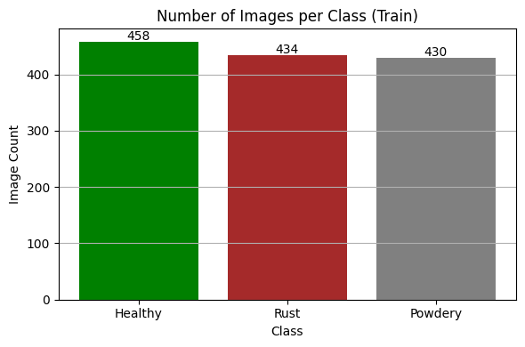
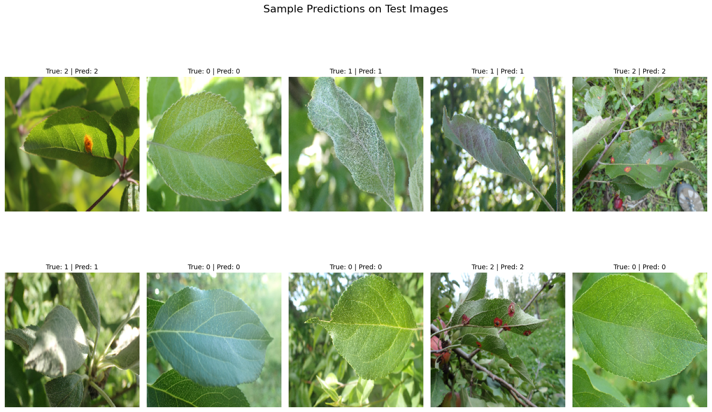

# 🌿 AgroScanAI: End-to-End Plant Disease Classification 🔬
A deep learning-based computer vision project to classify plant diseases using images of leaves — built with **CNN**, **VGG16**, and **ResNet50**.
## You can find the full code with outputs here: [Code](https://www.kaggle.com/code/jasminemohamed2545/a-plant-disease-classifier-vgg-resnet50-97-acc)
---

## 📸 Dataset

- Source: [Kaggle - Plant Disease Recognition](https://www.kaggle.com/datasets/rashikrahmanpritom/plant-disease-recognition-dataset)
- Classes:
  - 🌱 Healthy
  - 🍃 Powdery Mildew
  - 🍂 Rust

****
---

## 🧠 Models Used

| Model             | Preprocessing           | Accuracy |
|------------------|-------------------------|----------|
| Custom CNN        | `rescale=1./255`        | ✅       |
| VGG16             | `preprocess_input()`    | ✅       |
| ResNet50          | `preprocess_input()`    | ✅       |

---

## 📊 Evaluation Metrics

- ✅ Accuracy & Val Accuracy over Epochs
- 📉 Training & Validation Loss
- 🔍 Confusion Matrix
- 📋 Classification Report
- 🖼️ Visualized Predictions on Test Set

---

## 🚀 Key Takeaways

- Learned how **learning rate** directly impacts training efficiency
- Built a powerful, modular **`DataGenerator()`** for flexible preprocessing
- Compared model performance under fair evaluation conditions
- Saved and exported models for reuse + visualized results with Matplotlib

---

## 🔍 Sample Prediction Output

---

## 💡 Lessons Learned

🧠 **"Accuracy stuck at 33%?"** It wasn't the model, the data, or the augmentation...

✳ It was the **learning rate**!

- Lowering the LR from `0.001` to `0.0001` fixed the issue!
- Proper preprocessing based on the model is a **must** (CNN ≠ ResNet ≠ VGG)
---

## 📦 Tech Stack

- Python (TensorFlow, Keras, OpenCV, Matplotlib, Sklearn)
- Jupyter Notebooks
- Deep Learning (CNN, Transfer Learning)
- ImageDataGenerator for augmentation

---

## 📌 Future Improvements

- Add model monitoring & logging via Weights & Biases or MLflow
- Use class balancing / focal loss for better minority class performance
- Convert model to TensorFlow Lite for low-resource IoT deployment

---

## 🧑‍💻 Author

Made with ❤️ by Jasmine
---
